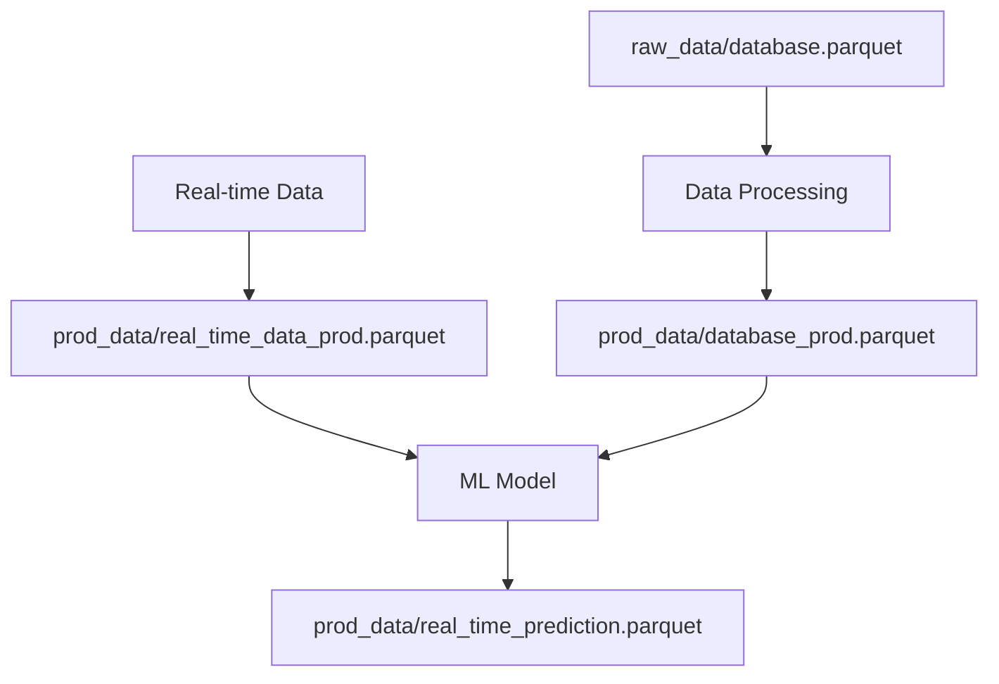

# Data Directory Structure

This directory contains all data files for the ML project, organized into different folders based on their purpose and lifecycle stage.

## 📁 Directory Structure

```
data/
├── raw_data/           # Raw, unprocessed data
├── prod_data/          # Production-ready data and predictions
└── README.md           # This file
```

## 📊 Folder Descriptions

### 🔵 `raw_data/` - Raw Data Storage

**Purpose**: Contains the original, unprocessed datasets used for model training and development.

**Contents**:
- `database.parquet` - Main raw dataset with bike sharing data
- `raw_data_full.parquet` - Complete raw dataset (potentially larger version)

**Data Schema** (based on config):
- `season` - Season of the year (1-4)
- `yr` - Year (0=2011, 1=2012)
- `mnth` - Month (1-12)
- `hr` - Hour of day (0-23)
- `weekday` - Day of week (0-6)
- `workingday` - Working day flag (0/1)
- `weathersit` - Weather situation (1-4)
- `temp` - Temperature (normalized)
- `atemp` - "Feels like" temperature (normalized)
- `hum` - Humidity (normalized)
- `windspeed` - Wind speed (normalized)
- `cnt` - Total bike count (target variable)
- `casual` - Casual user count
- `registered` - Registered user count
- `datetime` - Timestamp

**Usage**: 
- Used for initial data exploration and EDA
- Source for training data preparation
- Reference for data quality and completeness

### 🟢 `prod_data/` - Production Data

**Purpose**: Contains production-ready datasets and real-time prediction results.

**Contents**:
- `database_prod.parquet` - Production database (initialized from raw data)
- `real_time_data_prod.parquet` - Real-time data for live predictions
- `real_time_prediction.parquet` - Model predictions for real-time data

**Data Flow**:
1. **Initialization**: `database_prod.parquet` is created by copying `raw_data/database.parquet`
2. **Real-time Processing**: New data flows into `real_time_data_prod.parquet`
3. **Prediction Storage**: Model predictions are saved to `real_time_prediction.parquet`

**Features**:
- **Incremental Updates**: New data is appended to existing files
- **Timestamp Filtering**: Data can be sliced by time ranges
- **Prediction Persistence**: Model outputs are stored for monitoring and analysis

## 🗄️ Database Descriptions

### `database.parquet` / `database_prod.parquet`
- **Type**: Main dataset
- **Format**: Parquet (columnar, compressed)
- **Size**: Optimized for fast read/write operations
- **Schema**: Bike sharing data with temporal features
- **Use Case**: Training, validation, and production inference

### `raw_data_full.parquet`
- **Type**: Complete raw dataset
- **Format**: Parquet
- **Purpose**: Comprehensive dataset for thorough analysis
- **Use Case**: EDA, data quality assessment, feature engineering

### `real_time_data_prod.parquet`
- **Type**: Live data stream
- **Format**: Parquet
- **Update Frequency**: Real-time (as configured)
- **Purpose**: Current data for live predictions
- **Use Case**: Real-time inference, monitoring

### `real_time_prediction.parquet`
- **Type**: Prediction results
- **Format**: Parquet
- **Content**: Model predictions with timestamps
- **Purpose**: Store and track prediction performance
- **Use Case**: Model monitoring, performance analysis, debugging

## 🔄 Data Pipeline Flow



## ⚙️ Configuration

Data paths and filenames are configured in `config/config.yaml`:

```yaml
data_manager:
  raw_data_folder: './data/raw_data/'
  prod_data_folder: './data/prod_data/'
  raw_database_name: 'database.parquet'
  prod_database_name: 'database_prod.parquet'
  real_time_data_prod_name: 'real_time_data_prod.parquet'
  real_time_prediction_data_name: 'real_time_prediction.parquet'
```

## 🚀 Usage Examples

### Loading Raw Data
```python
import pandas as pd
from common.data_manager import DataManager

# Load raw data for EDA
df = pd.read_parquet('data/raw_data/database.parquet')
```

### Production Data Management
```python
# Initialize production database
data_manager = DataManager(config)
data_manager.initialize_prod_database()

# Load production data
prod_df = pd.read_parquet('data/prod_data/database_prod.parquet')
```

### Real-time Predictions
```python
# Load real-time data
rt_data = pd.read_parquet('data/prod_data/real_time_data_prod.parquet')

# Load predictions
predictions = pd.read_parquet('data/prod_data/real_time_prediction.parquet')
```

## 📈 Data Characteristics

- **Temporal Data**: Time series with hourly granularity
- **Target Variable**: Bike count prediction
- **Features**: Weather, time, and usage patterns
- **Time Range**: 2011-2012 (as per config)
- **Update Frequency**: Real-time for production data

## 🔧 Maintenance

- **Backup**: Regular backups of production data
- **Cleanup**: Old prediction files can be archived
- **Monitoring**: Track file sizes and update frequencies
- **Validation**: Ensure data quality and schema consistency

## 📝 Notes

- All files use Parquet format for optimal performance
- Data is organized by lifecycle stage (raw → production)
- Real-time data follows incremental update pattern
- Predictions are stored for model monitoring and analysis
